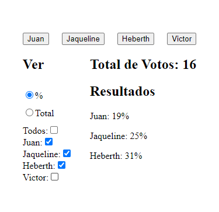

# Make It Real - Voting System

This is a solution to the **Voting System** project of the Make It Real course.

## Table of contents

- [Overview](#overview)
  - [The challenge](#the-challenge)
  - [Screenshot](#screenshot)
- [My process](#my-process)
  - [Built with](#built-with)
  - [What I learned](#what-i-learned)
  - [Continued development](#continued-development)
  - [Useful resources](#useful-resources)
- [Author](#author)
- [Acknowledgments](#acknowledgments)

## Overview

### The challenge

- This system features 4 candidates, each represented by a component that allows users to cast votes for the corresponding candidate.
- A TotalVotes component that displays the total number of votes.
- A VotesPerCandidate component that shows individual voting results for each candidate. These can be displayed either as numbers or percentages, depending on the user's filter selection.
- A Filter component that allows users to toggle between viewing results as percentages or as totals. Additionally, users can select which candidates' results to display.
- The system automatically calculates the percentage for each candidate whenever a new vote is added.

### Screenshot



## My process

1. Structure the HTML and CSS.
2. Implement voting functionality.
3. Add functionality to view votes.
4. Add filtering functionality to customize the display.

### Built with

- Semantic HTML5 markup
- CSS custom properties
- Flexbox
- React's useContext
- React's useState
- React's useEffect

### What I learned

Handling input elements in HTML:

```html
<label htmlFor="selectAll">Todos:</label> <input type="checkbox" id="selectAll"
name="selectAll" onChange={selectAllCandidates}
checked={selectedCandidates.length === candidates.length} />
```

Using React's useContext to manage global state:

```js
function App() {
  return (
    <main>
      <CandidatesProvider>
        <Candidates />
        <section className="results">
          <Filter />
          <section className="votes">
            <TotalVotes />
            <VotesPerCandidate />
          </section>
        </section>
      </CandidatesProvider>
    </main>
  );
}
```

### Continued development

I will learn useReducer hook

### Useful resources

- [Form controls](https://developer.mozilla.org/en-US/docs/Learn/Forms/Basic_native_form_controls#actual_buttons) - This helped me recall how to properly implement form inputs and use the checked attribute effectively.

## Author

- Linkedin - [Juan Alva](https://www.linkedin.com/in/juan-luis-alva/)

## Acknowledgments

A big thanks to the Make It Real team for their patience and support.
